import Text from "../components/text.js"
import Columns from "../components/columns.js"
export default Text

<Text>

### Setting the stage

Live-streaming has taken over the way we consume media. Only 25% of the population in the U.S. had live-streamed online content back in 2017. At the time of writing this project, in 2020, that number approached 80%. This massive increase was due in part to the COVID-19 pandemic, which forced people to move many real-world experiences into the digital. One of these experiences was attending a live concert. I wanted to explore the music live-streaming space and see how concert goers were faring during the pandemic. What follows is a journey through this space, culminating in an app design that provides the live concert experience to music fans in the comfort of their homes. 

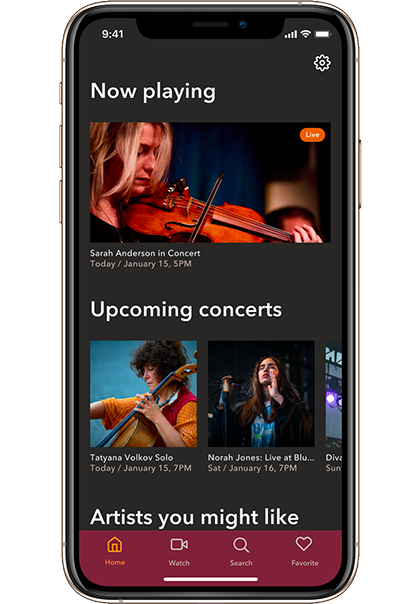

### The Problem

Live music was on pause due to COVID-19 and concert goers could no longer go out to get their concert fix. While live-streaming doubled between 2019 and 2020 due to COVD-19, fans of live music performances accounted for only a fraction of viewership. 

My high level goals were to:

*   Identify experience gaps for music live-streaming services.
*   Find out what people wanted and needed from music live-streaming services.
*   Better define the audience characteristic and use cases for music live-streaming services.

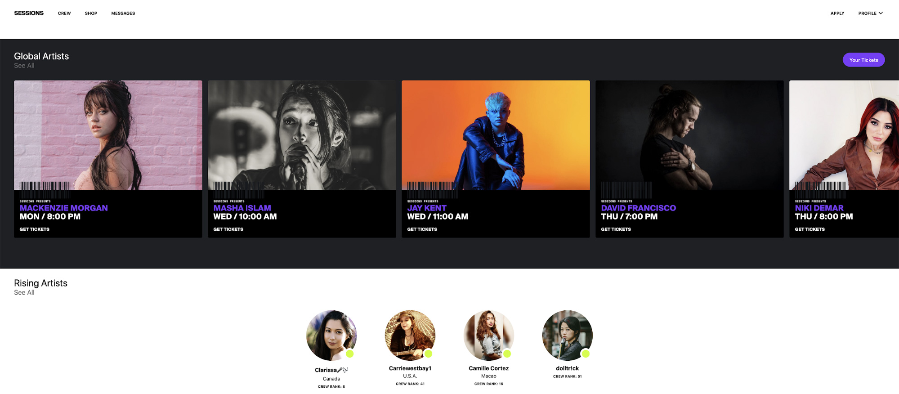

_A sample carousel of concerts from the music live-streaming service,_ _Sessions_

  

### My Role

I was the sole UX designer and worked on the project from October 2020 until January 2021. My responsibilities included discovery, ideation, and visual design. After several rounds of testing from low to high fidelity design, I delivered a high fidelity prototype of the app.

<Columns>

What I did:

*   Research
*   User interviews
*   Ideation
*   Visual design and prototyping
*   Testing

Tools used:

*   Figma
*   Adobe Illustrator, Photoshop, and Premiere
*   Logic Pro X (audio production)
*   Marvel
*   Pen and paper

</Columns>

### The elephant in the room

It goes without saying that COVID-19 affected this project in a big way. Nearly all interviews and usability testing happened remotely. This was exciting and challenging. On one hand, I could test a design in the digital world it was meant to live in. However, it took much more effort to recruit purely digitally. It also meant accepting the shortcomings of internet connections, web-based prototype bugs, and missing out on some of the helpful non-verbal cues that come up during in-person interviews.

### Getting started

#### Discovery

##### **A look at the industry**

To better understand what concert goers were dealing with, I started researching the live-streaming space. How did music live-streaming fit in specifically? The numbers were astounding. According to a [report by Forbes](https://www.forbes.com/sites/paultassi/2020/05/16/report-livestream-viewership-grew-99-in-lockdown-microsofts-mixer-grew-02/?sh=33db6cf076cb), live-streaming increased by 99% between 2019 and 2020 — nearly doubling in one year! COVID-19 played a big part in this, accelerating the shift of real world content to digital which had already been happening. 

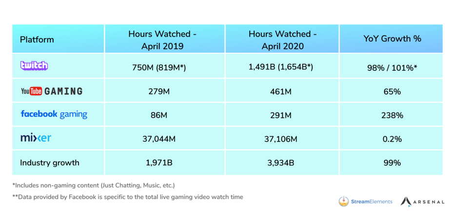

But the numbers didn’t look so good for musical content. Live music performances consistently ranked toward the bottom of offerings on the most popular live-streaming platforms. For instance, _Music and Performances_[ ranked #20 on Twitch](https://www.twitchmetrics.net/g/26936-music) at the time of research. And most of the content in this category consisted of informal performances geared toward audiences under 34. 

While millennials had the [largest number of concert goers](https://gobranded.com/branded-poll-millennials-driving-growth-in-live-music-industry/#:~:text=Roughly%2089%20percent%20of%20Millennials,Silent%20Generation%20(age%2070%2B).), there was still an entire range of people over 40 to account for. And only 20% of people over 40 even had a live-streaming subscription of some kind. Statistics like these suggested that there was a problem with engaging concert goers through current live-streaming offerings.

##### Getting to know concert goers

I knew I needed to dive deeper into the problem and speak to concert goers directly. I sent out a recruitment survey to find out about general music preferences, live concert attendance, and experience with regular streaming and live-streaming. 38 fans of live music responded, ranging from people in their early 20’s to those in their 70’s. Their top genres were jazz, classical, pop, rock, and world music. People were surprisingly experienced -- nearly 80% had live-streamed music before. Also, it was interesting that country music was not so popular. A larger sample might’ve resulted in a different set of top genres and live-streaming know-how.

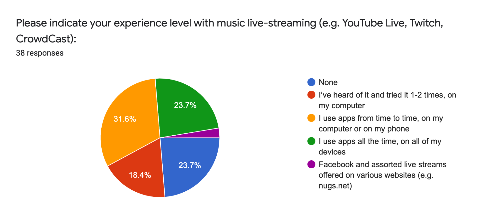

After going through the survey responses, I set up 7 interviews with a wide age range and a variety of musical interests in mind. The goal was to gain insight by comparison: 2 of the interviewees were between the ages of 21-30, while the remaining 6 were evenly distributed from 40-75. What would all of these concert goers have in common, if anything, when using a live-streaming service for music?

I arranged the interview topics to go from the physical to the digital — from live concert habits, to regular, pre-recorded music streaming, to contextual inquiry with a current, dedicated music live-streaming app called _Sessions_. This would help get participants to think more about which aspects of the real concert experience they wanted to have in the digital.  

##### Early insights

Participants were passionate and outspoken. The responses to my interview questions were powerful. When asked what being at a live concert felt like, one person responded:

> *"Just being in the actual room with that sound surrounding your whole body is a great feeling."*

##### When it came to music live-streaming, people had a lot in common

When I asked specifically — what would you look for in a music live-streaming service — people pointed out similar things: something that would have good categories mapped out, a variety of music, and being able to customize music preferences.

I took these findings and began to distill them, first with an affinity map:

<!-- maybe a short video clip here instead of the GIF? -->

This helped confirm what I noticed people pointing out during the interviews: they wanted something that felt “live,” felt personalized, was easy to navigate, and had a variety of content. I wanted to focus on these points and their accompanying desires and frustrations even more. Because these concert goers were sharing so many common points, I created personas to represent them.

</Text>  

##### There were 4 types of users

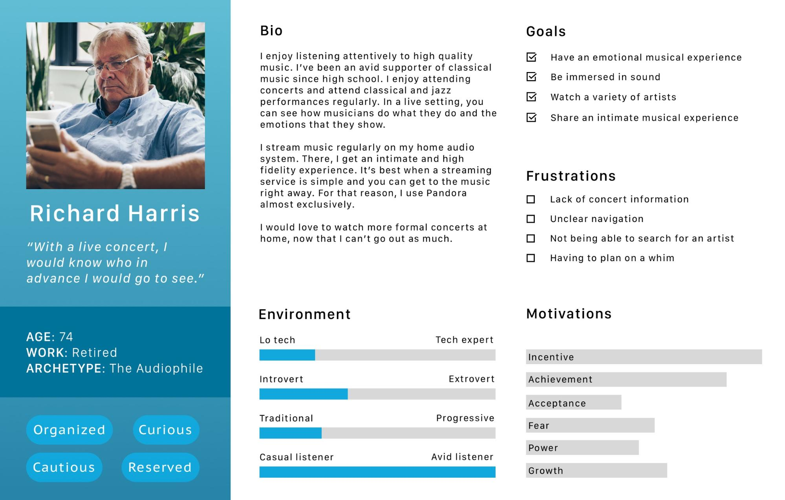

Richard, The Audiophile wanted an immersive viewing experience and something that was easy to use.

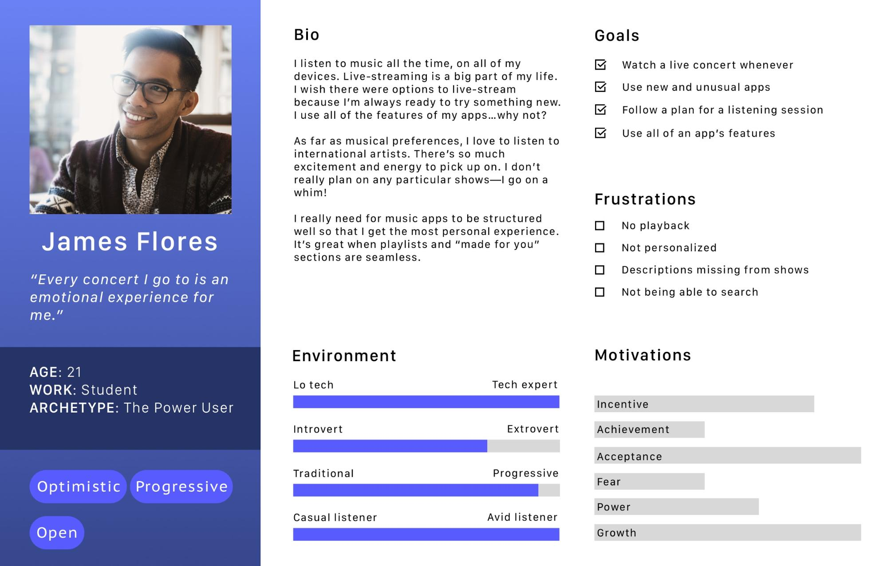

James, The Power User, was very tech savvy and loved the bells and whistles in some of the music apps out there.

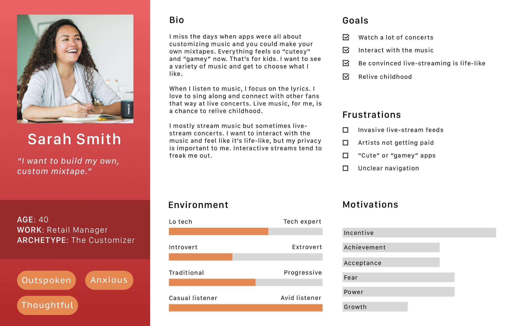

Sarah, The Customizer,  wanted the most life-like experience, like chatting with other virtual concert attendees.

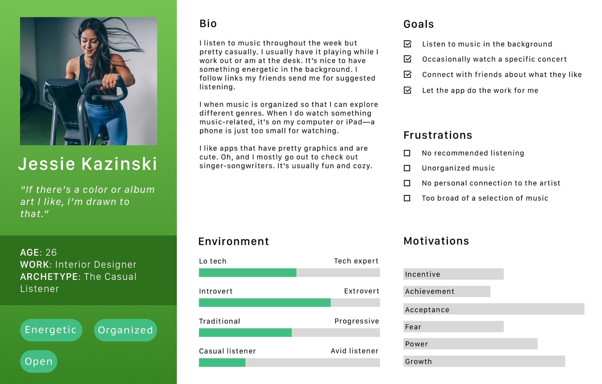

Jessie, The Casual Listener, who, like Richard, wanted something easy to use but that could play in the background if she couldn’t actively watch. 

<Text>

##### Revisiting the problem

So far, I knew that there was an entire range of people over 40 that wasn’t engaging with live-streaming offerings. On top of that, I learned that:

*   People expected to see concert info when buying a ticket online
*   They prefered to watch live-streams on a large device
*   They were more likely to select concerts that were in a visually appealing presentation format, like a card with an image and text or hero image with accompanying copy
*   They prefered to organize their music by favorite artist and genre

This brought up a question that helped shape the problem space: 

**how might we engage concert goers with more immersive live-streaming offerings?**

### Letting the imagination run wild

#### Ideation

##### Turning interview insights into design features

At this point, I had a lot of ideas about what the design could look like. I pulled out the pen and paper and sketched out possible ideas, including:

*   Concert programs
*   Visually engaging virtual tickets 
*   Artist profiles with featured images 
*   3D audio and video settings

</Text>

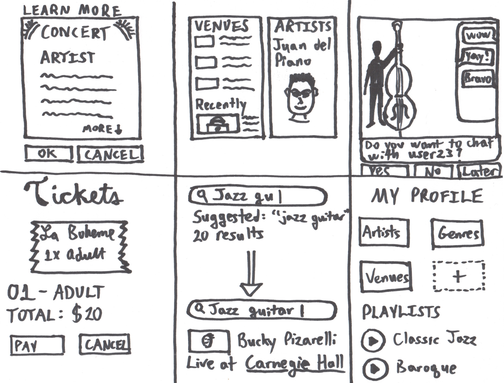

<Text>

One of the thoughts that kept coming back: how could we keep concert live-streaming as immersive as its real-life counterpart? You can watch a clip of this process below.

<!-- Include video of ideation 2 -->

##### A map showing the way back to the users

Exploring a bunch of ideas was inspiring but staying true to the interview insights and personas was still the primary goal. So, I set out to map only the features that users needed with a set of user stories.

</Text>

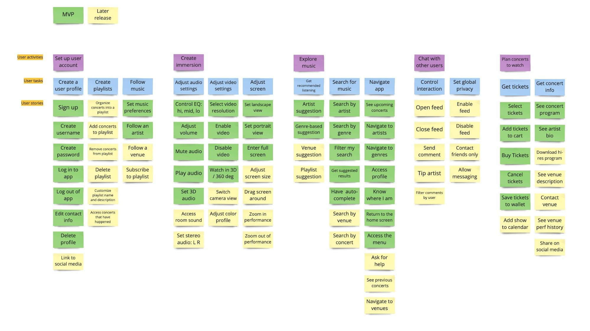

<Text>

This added focus but also helped break down the major needs into the individual features that they were made of. Now I had a rough design blueprint for a minimum viable product. The critical features were:

*   Create a profile
*   Set music preferences
*   Search for concerts
*   Get concert info
*   Buy tickets
*   Watch a concert

##### Staying organized and going with the flow

Before moving on to visual design, I had to ensure that all of these features could flow in a logical way. I grouped the critical features into 3 red routes: personalize account, buy a concert ticket, and watch a concert. “Personalize account” addressed people’s needs to be able to create a profile and set music preferences; “Buy a concert ticket” included searching for concerts, getting concert info, and buying the tickets; “Watch a concert” allowed people to live-stream the concert in immersive audio and video. I would later change the wording of these routes as I went back over the designs. For now, this was enough to create user flows for the upcoming design.

</Text>

###### Personalize Account

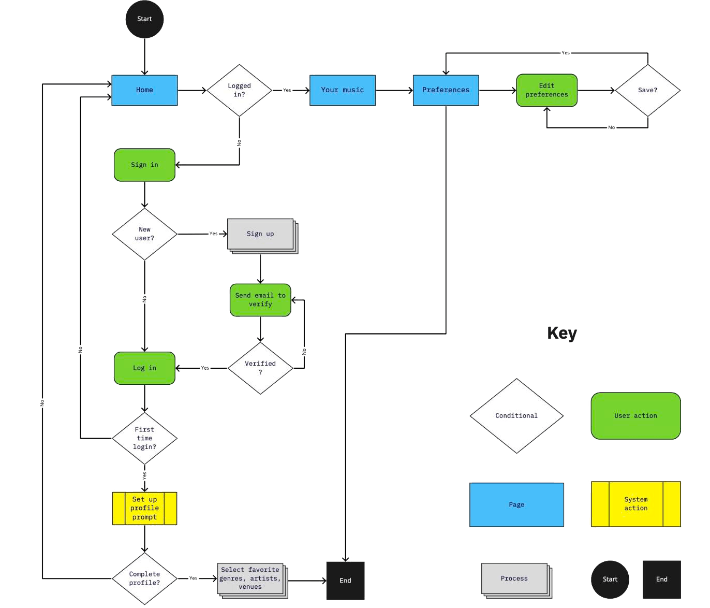

###### Buy a concert ticket

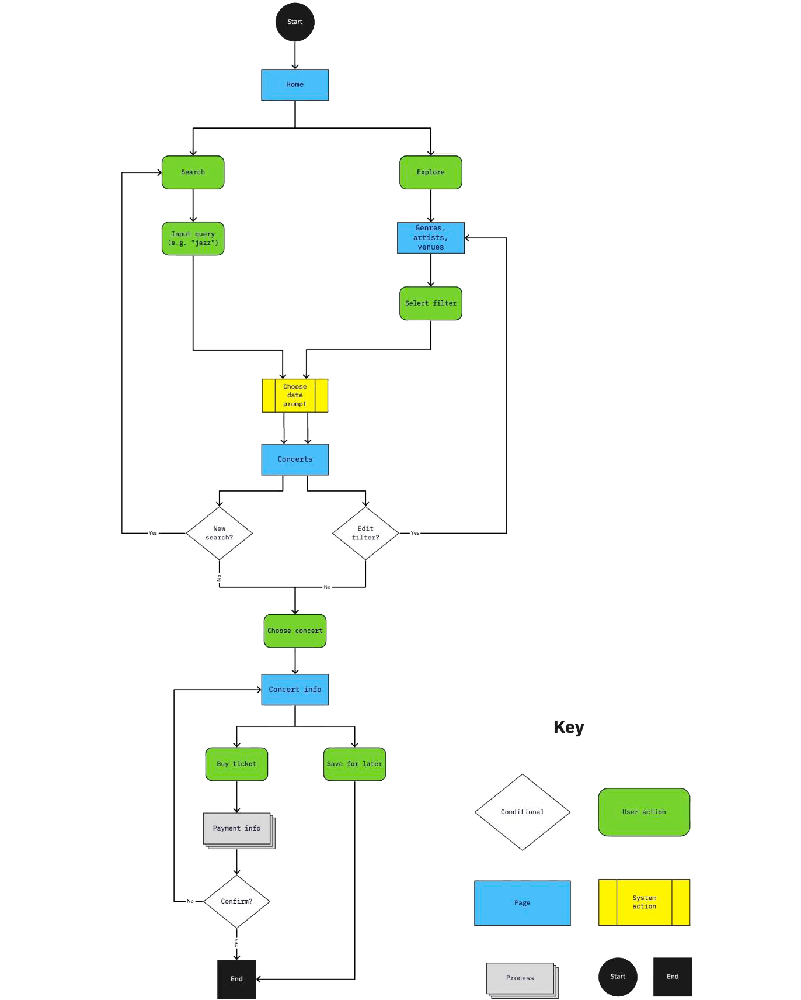

###### Watch a concert

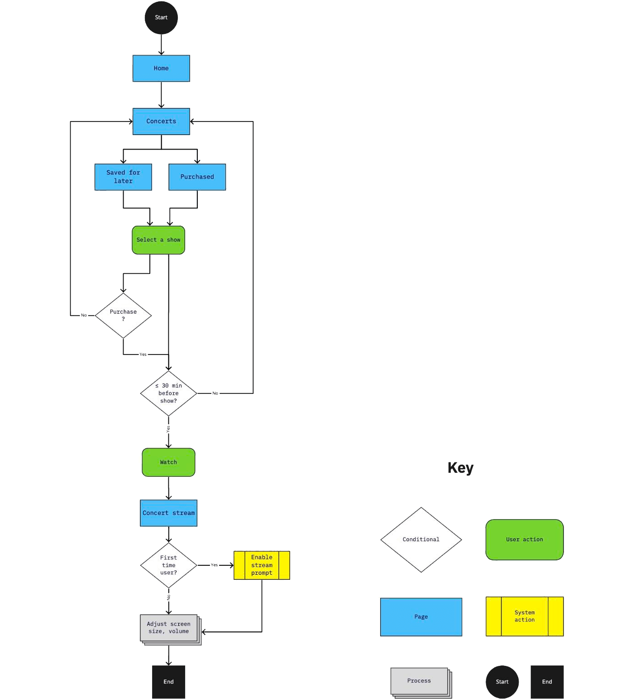  

<Text>

### Creating the music live-streaming experience

#### Design

##### Refining critical features into red routes

I started by sketching out the 3 red routes based on the user flows: to sign up, find and purchase a concert, and watch a concert — seen in that order below. 

</Text>

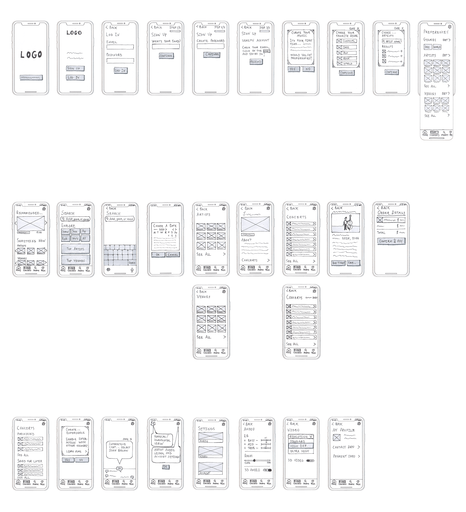  

<Text>

##### A usability test is worth 1000 Figma auto-saves

Before going any further, I wanted to test the usability of these initial routes. Marvel offered a great paper prototyping tool called POP, which I used to create an initial prototype. 

<!-- Video of paper prototype -->

_A video snippet of the paper prototype_

I got 5 unsuspecting  participants to take the prototype for a test-drive. I’m glad I was able to test this early in the visual design stage — the results revealed some serious flaws. First, the app seemed like it was for buying tickets to actual live concerts instead of live-streams. Second, it wasn’t clear how the search functionality would work. Finally, participants weren’t sure when the concerts were “going live.” This was a good time for improvement and there were still several opportunities ahead to hone the design.

##### Wireframing the 3 red routes

I applied the findings from this guerrilla testing to the next round of design: wireframes. 

</Text>

###### Sign Up

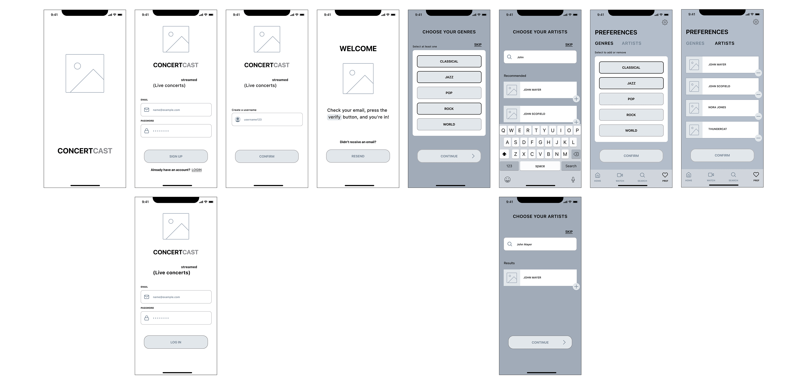  

###### Find and purchase a concert

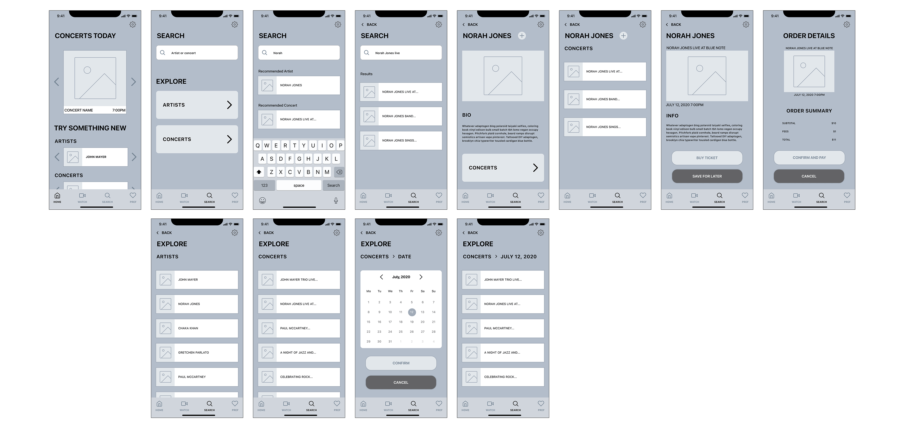  

###### Watch a concert

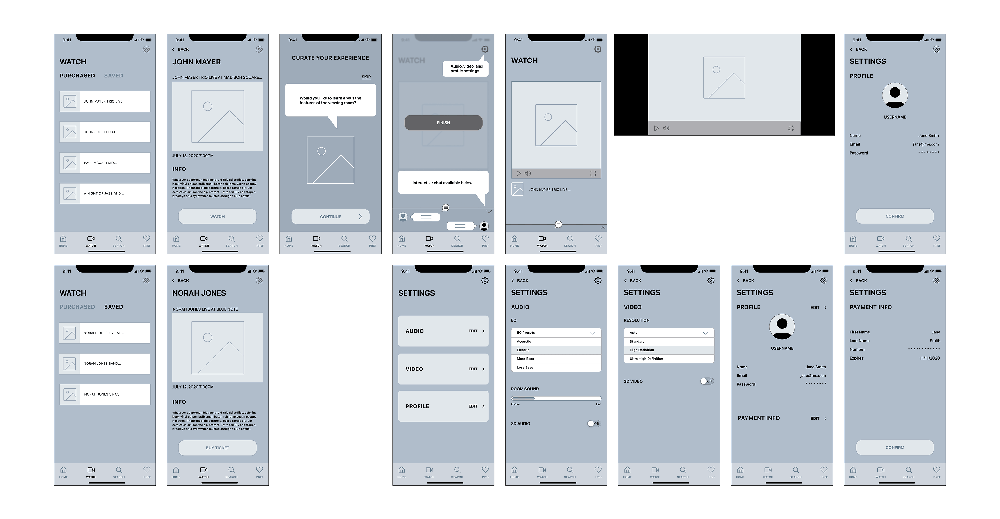 

<Text>

Some of the main features I added were:

*   A search input to find favorite artists during onboarding instead of a massive list of artists which would overwhelm users
*   Date filter modals to address the edge case of scrolling through endless concert listings
*   A cart functionality to support people’s desire for a more realistic concert experience, like buying concert tickets in real life
*   Helper modals explaining video player functionality to first-time users
*   Audio and video settings for recreating a virtual concert environment, like room sound, 3D audio, and 3D video

##### Breathing life into the design through branding and a style guide

Like previous parts of the project, having a foundation before making a big design decision was crucial. Even though I fixed the major usability issues for each red route and the logic checked out, the design still didn’t have an identity; it was still a concept and not a product. 

I approached this by creating a branding and style guide. This was a large endeavor that included 8 unique parts: a brand platform, logo and logotype, color palette, typography, grid system, icons, components, and images. The idea was to bring the design to life and give it a vision that concert goers could align with. The result was Onstage, an app which brought the live concert experience to users in their home. This connected full circle with the initial discovery of the problem space by extending live concert streaming offerings to a wider range of concert goers, based on their preferences and needs.

The entire style guide was a hefty 33-page affair, but here are some of the critical parts:

##### Leveling up to high fidelity

Using the style guide, I created high fidelity screens for the red routes. 

</Text>

###### Sign Up

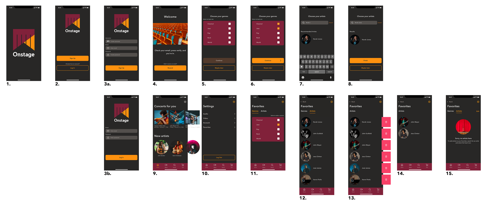 

###### Find and purchase a concert

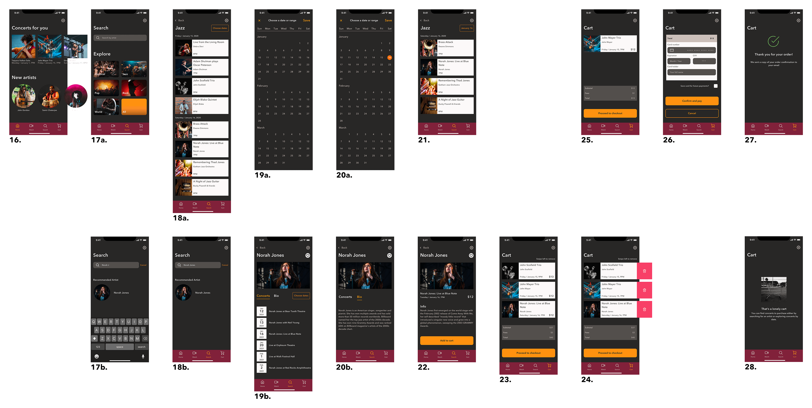 

###### Watch a concert

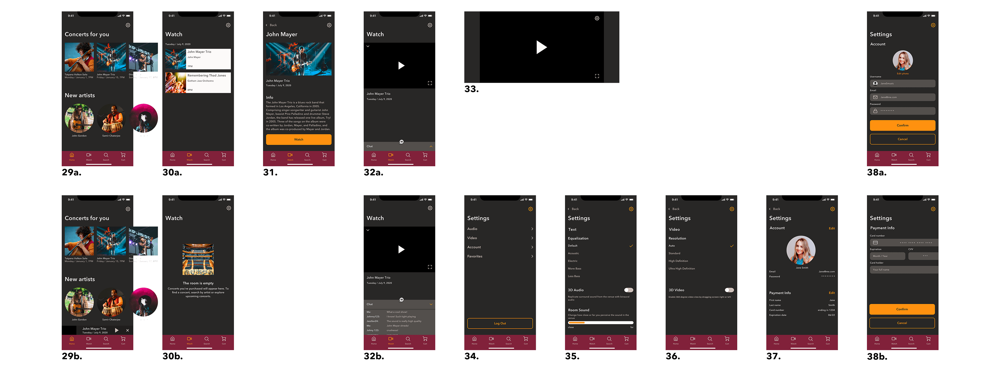 

<Text>

Some of the main features I added here were:

*   1, 2, 3a, 3b: the logo for login
*   the color scheme throughout the design
*   15, 28, 30b: Empty state to engage users and encourage exploration of the interface
*   13, 24: A swipe to delete functionality
*   27: Success state to empower actions such as purchasing concerts
*   19a, 20a: An interactive, scrollable calendar to filter by date on a separate page instead of a modal

##### Staying true to the fans with more usability testing

I was getting close to the end of the project and all that was left was to test and iterate on the high fidelity design. I built another prototype, this time with animations and more complex interactions to add delight to all of the functionality. There were 2 usability tests with a total of 13 participants. The critical prioritized recommendations were: to make artist and genre preferences easier to find, redesign the search flow to make it clearer, and to make audio and video settings easier to access from the video player. I made these adjustments before delivering the final prototype.

  

### The end of the story, for now

#### Outcome and lessons

The project ended with a final prototype of the app (video shown on the right), Onstage. Its mission was to provide an immersive live concert experience to music fans, in the comfort of their home. The project was well received and people hoped it would go into development so that they could view actual concerts.

There were also some important lessons to address: 

*   **Modeling the concert venue:** it’s challenging to model the concert venue, an essential part of the vibe of live concerts, in the digital space. “Watch” worked as a spot to house the purchased tickets and video player but not everybody imagined that to be the structure in the app for finally “attending” the concert virtually. 
*   **Handling the infinite scrolling edge case:** It’s particularly hard to address this edge case in a design. While it’s possible to set an Instagram-as-of-2018 limit to the endless scroll, there still needs to be sufficient content to make the prototype convey that it offers extensive personalized musical content.

I would certainly like to develop a working app in the future and hope that the virtual concerts of tomorrow will support live music fans and artists alike. Let’s see what happens. 

</Text>